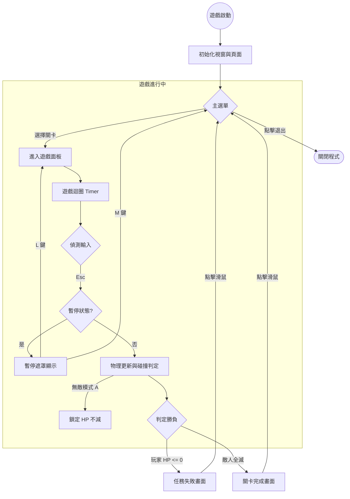

# 專題名稱：星際大戰 (Star Wars Ultimate)

## 👥 小組資訊

* **組別名稱**：GXX_kevinzhong0318_47_leepetercat_0975365318
* **小組 public GitHub repo**：[點此連結](https://github.com/kevinzhong0318/GXX_kevinzhong0318_47_-leepetercat-09)
* **備註**：本組後續將使用 Pull Request 紀錄每週進度。

### 組員名單

| 姓名             | 學號      | GitHub                                         | 角色分工                     |
| :--------------- | :-------- | :--------------------------------------------- | :--------------------------- |
| **鐘善民** | B11107147 | [kevinzhong318](https://github.com/kevinzhong318) | 核心邏輯、敵人 AI、關卡設計  |
| **李品學** | B11332009 | [leepetercat](https://github.com/leepetercat)     | 介面開發、資源管理、專案控管 |

---

## 🎮 遊玩方式說明

本遊戲支援跨平台操作，請確保您的輸入法處於英文模式以獲得最佳體驗。

* **滑鼠操作**：
  * `左鍵`：射擊單發子彈。
  * `右鍵`：同時射擊兩發擴散子彈。
* **鍵盤快捷鍵**：
  * `A`：開啟或關閉 **無敵模式**（God Mode）。
  * `Esc`：**暫停遊戲**（可進一步選擇繼續或回到主選單）。
  * `L`：暫停選單中，選擇「繼續遊戲」。
  * `M`：暫停選單中，選擇「回到主選單」。

---

## 📊 遊戲流程圖

我們使用 Mermaid 語法來展示遊戲的狀態切換與核心邏輯，確保程式架構清晰。

